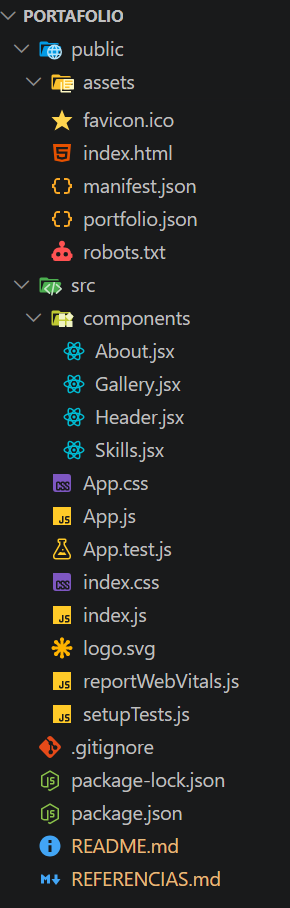
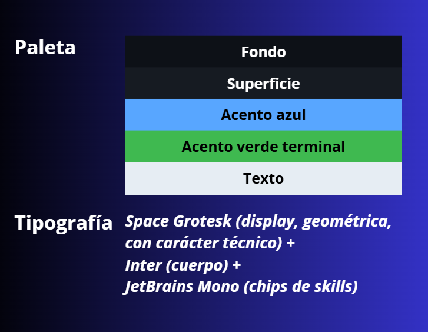
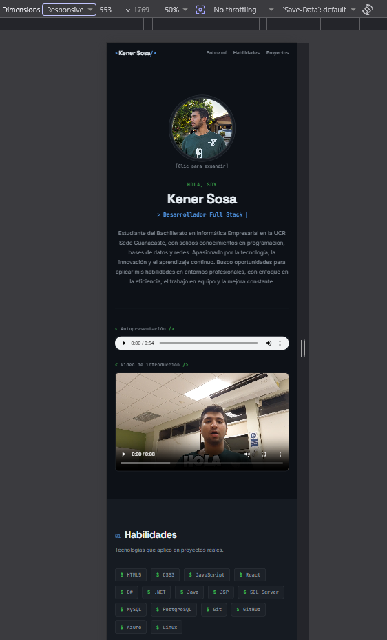
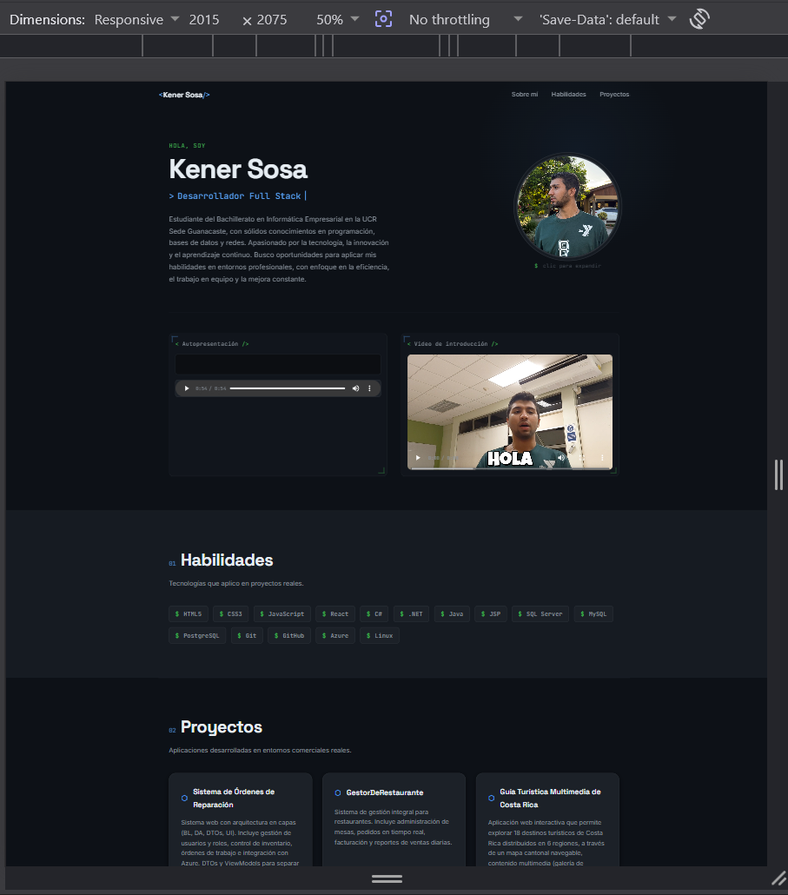

# Portafolio Multimedia Personal — Kener Sosa

> Proyecto Personal · IF7102 Multimedios · UCR Sede Guanacaste · I Ciclo 2026

Aplicación web multimedia de presentación profesional construida de forma autónoma con **React.js (v18)** como parte del componente de investigación del curso IF7102. Estructurada en componentes desacoplados y reutilizables, con consumo de datos dinámico desde JSON via la API `fetch` nativa.

🔗 **Demo en vivo:** [https://JKenSR.github.io/portafolio](https://JKenSR.github.io/portafolio)

---

## Framework utilizado

| Herramienta          | Versión   |
|----------------------|-----------|
| React                | ^18.3.1   |
| react-scripts (CRA)  | 5.0.1     |
| gh-pages (despliegue)| ^6.x      |
| Node.js recomendado  | >= 18.x   |

---

## Estructura del proyecto

```
portafolio/
├── public/
│   ├── assets/
│   │   ├── audio/          ← presentacion.mp3  (audio de autopresentación)
│   │   ├── images/         ← Perfil.jpg         (fotografía propia)
│   │   └── video/          ← introduccion.mp4   (video de introducción)
│   └── portfolio.json      ← fuente de datos dinámica
├── src/
│   ├── components/
│   │   ├── Header.jsx      ← navegación sticky con smooth scroll
│   │   ├── About.jsx       ← hero, multimedia y lightbox de foto
│   │   ├── Skills.jsx      ← grid de habilidades animado
│   │   └── Gallery.jsx     ← tarjetas de proyectos animadas
│   ├── App.js              ← fetch, useState, useEffect, distribución de props
│   └── App.css             ← sistema de diseño completo con variables CSS
├── README.md
└── REFERENCIAS.md
```

---

## Funcionalidades implementadas con React

| Concepto React       | Dónde se aplica                                                  |
|----------------------|------------------------------------------------------------------|
| `useState`           | Estado de carga/error en `App.js`, modal del lightbox en `About.jsx` |
| `useEffect`          | `fetch()` del JSON, listener de scroll en `Header.jsx`, `IntersectionObserver` en `Skills.jsx` y `Gallery.jsx` |
| `useRef`             | Referencia al DOM para las animaciones de scroll en `Skills.jsx` y `Gallery.jsx` |
| `props`              | Datos distribuidos de `App.js` → `Header`, `About`, `Skills`, `Gallery` |
| `.map()`             | Renderizado de habilidades, proyectos, navegación y tech-tags con `key` única |
| Eventos (`onClick`)  | Navegación smooth scroll, abrir/cerrar lightbox de foto          |
| `process.env.PUBLIC_URL` | Rutas de assets compatibles con localhost y GitHub Pages      |

---

## Capturas de pantalla

<table width="100%">
  <tr>
    <td width="50%" align="center">
      
      <br><sub><b>Estructura</b></sub>
    </td>
    <td width="50%" align="center">
      
      <br><sub><b>Diseño</b></sub>
    </td>
  </tr>
  
  <tr>
    <td width="50%" align="center">
      
      <br><sub><b>Responsiva Móvil</b></sub>
    </td>
    <td width="50%" align="center">
      
      <br><sub><b>Responsiva Desktop</b></sub>
    </td>
  </tr>
</table>

## Instrucciones de ejecución local

### Requisitos previos
- [Node.js](https://nodejs.org/) v18 o superior
- [Git](https://git-scm.com/)

### Pasos

**1. Clonar el repositorio**
```bash
git clone https://github.com/JKenSR/portafolio.git
cd portafolio
```

**2. Instalar dependencias**
```bash
npm install
```

**3. Ejecutar en modo desarrollo**
```bash
npm start
```
La aplicación abre automáticamente en `http://localhost:3000`.

> **Nota:** Para que el audio, video y foto carguen correctamente, asegurarse de que los archivos existan en `public/assets/audio/presentacion.mp3`, `public/assets/video/introduccion.mp4` y `public/assets/images/Perfil.jpg`.

---

## Despliegue a GitHub Pages

El pipeline de despliegue continuo está configurado en `package.json` con los scripts `predeploy` y `deploy`, enlazados a la propiedad `"homepage"`.

**Para desplegar una nueva versión:**
```bash
npm run deploy
```
Este comando ejecuta internamente:
1. `npm run build` — genera el bundle de producción optimizado en `/build`
2. `gh-pages -d build` — publica el contenido en la rama `gh-pages` del repositorio

> El primer despliegue puede tardar 1–3 minutos en propagarse. Verificar en *Settings → Pages* del repositorio que la fuente sea la rama `gh-pages`.

---

## Datos dinámicos (portfolio.json)

La aplicación no tiene datos en el código fuente. Todo el contenido (nombre, bio, habilidades y proyectos) se carga en tiempo de ejecución desde `public/portfolio.json` usando `fetch()`:

```js
fetch(`${process.env.PUBLIC_URL}/portfolio.json`)
  .then(res => res.json())
  .then(data => setPortfolioData(data));
```

Para actualizar el contenido del portafolio, basta con editar `portfolio.json` y hacer commit — no es necesario modificar ningún componente.

---

## Autor

**Kener Josué Sosa Rodríguez**  
Estudiante de Bachillerato en Informática Empresarial  
Universidad de Costa Rica — Sede Guanacaste  
📧 Justkenersosa@gmail.com  
🔗 [github.com/JKenSR](https://github.com/JKenSR)

---

*Proyecto académico individual · IF7102 Multimedios · Lic. Alonso Chavarria Cubero · I Ciclo 2026*